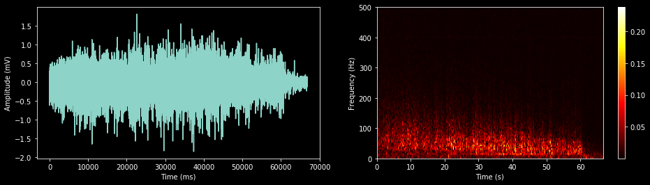

# EMG_Analysis
Analysis of the data from electromyograms done in Advanced Electronics.

See Muscular_Fatigue_Data_Analysis.ipynb for the code that generated the graphs below.

## Example of Short Time Fourier Transform - no noise and high noise

  

## Graphs from previous year's EMG

  

  

  

  

  

  

  

  

## Graphs from this year - comparative

  

  

  

  

  

  

  

  

  

  

  

  

  

